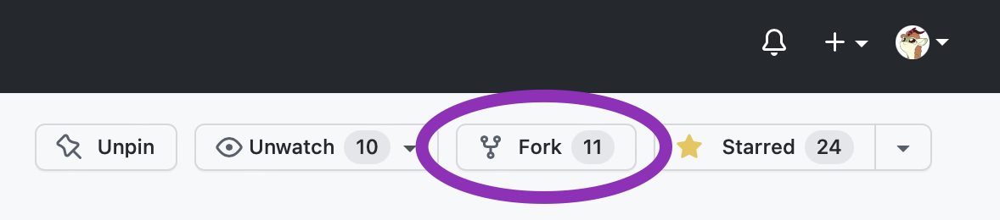
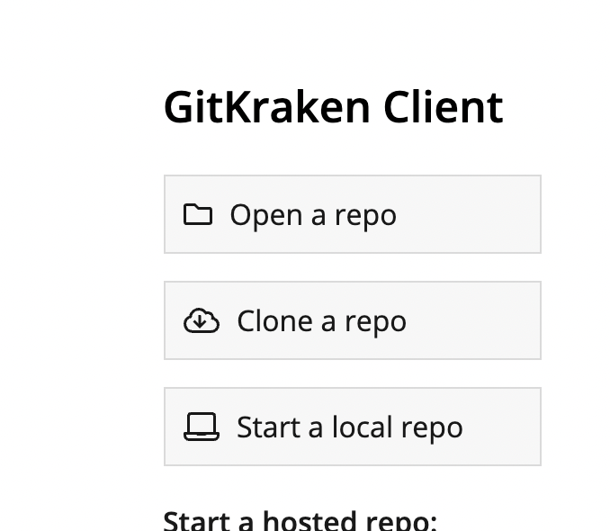
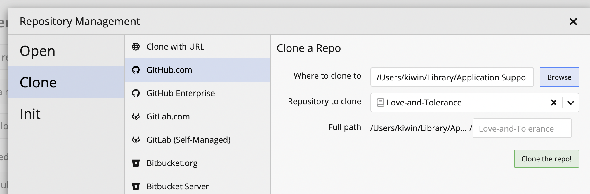
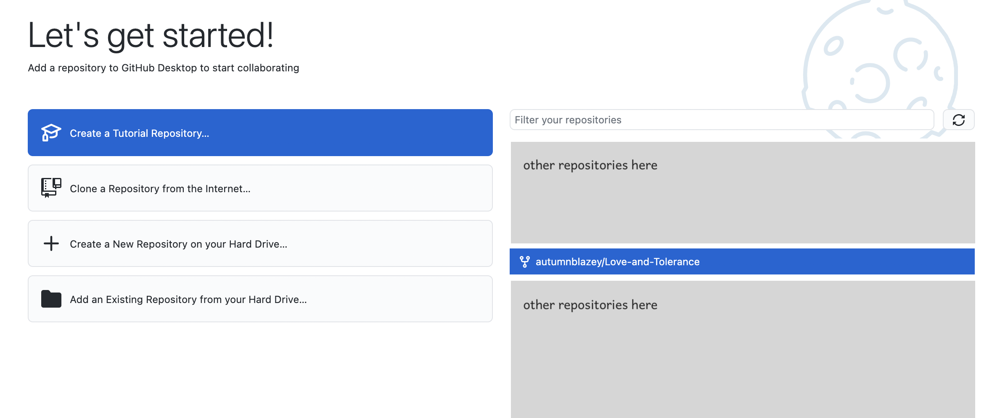
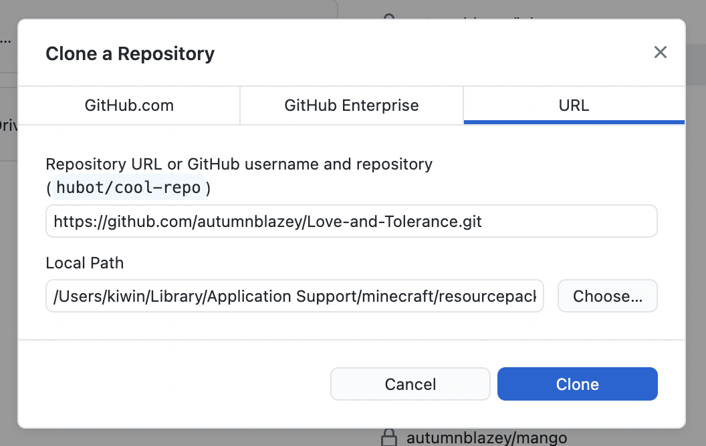

# Contributing

Feel free to contribute!

You can give suggestions by ask in #suggestions in our [Discord server]. You can also create a new discussion [on GitHub Discussions](https://github.com/Love-and-Tolerance/Love-and-Tolerance/discussions) under the ideas category.

If you decide you want to contribute directly, thank you! Please join our [Discord server], so we can easily communicate with you and provide feedback. On Discord, anyone that contributes directly can receive a role with a color of their choice, and access to a contributor only chat channel.

In this document, we'll describe how to contribute to our project! We will recommend using [GitKraken](https://www.gitkraken.com) or [Github Desktop](https://desktop.github.com), and there will be examples for both. Of course, if you know how to, you can always use command-line git as well.

## Setup

To contribute to the project, you will need to have a GitHub account, which you can create [here](https://github.com/signup) if you don't have one already. Once you have one, sign in and click `Fork` which is on the top right corner of the page. Now, you have your own copy of the project on your account, which you can make changes to.

Minecraft can read resource packs from folders as well as zip files. You can clone the repository directly into the resource pack folder, and you can enable the resource pack in Minecraft settings as you would expect.

### GitKraken

- Press "Clone a repo" while on a new tab. If you already had a repository open, you can create a new tab
- On the centre column, click "Github.com"
- Then on the right side:
  - fill in "Where to clone to" with your Minecraft resource packs folder
  - on "Repository to clone", select your forked repository (`Love-and-Tolerance`, under the section with your username on it)
  - you can leave "Full path" blank
- click "Clone the repo!"

### GitHub Desktop

For first time users:

- make sure you sign in to GitHub during the setup process
- a list of your repositories is on the right side of the welcome window, find your forked repository (`Love-and-Tolerance`, under the section with your username on it) and click it
- Change the "Local Path" to your Minecraft resource packs folder by clicking "Choose..." on the side of the field
  - in the field, you can leave "Clone as" set to the default value
- click "Clone"

## Making changes

You can now make a change to the resource pack that you just cloned! If you want or need an extensive guide on resource packs and how to make/maintain them, check out [our very extensive guide](https://github.com/Love-and-Tolerance/Resource-Pack-Guide) on how to make a resource pack. On there, there are many links to other resources as well.

One thing that is worth mentioning here is that you can use `f3 + t` in Minecraft to reload resource packs. Do this whenever you make a change to see the change ingame. On some laptops/keyboards that have the function row perform special functions by default (like adjust brightness), you may need to press `fn + f3 + t` instead.

## Committing changes

When you are done making changes and testing them, you will want to commit them. Before doing this, it is a good idea to create a new branch.

[Discord server]: https://discord.gg/y8cybKe
